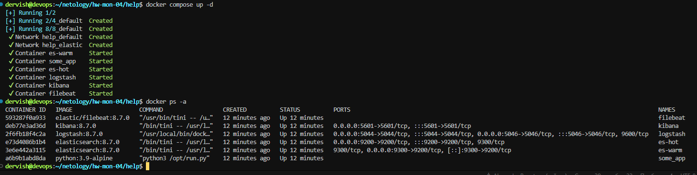

## Задание 1

Вам необходимо поднять в докере и связать между собой:
    
    elasticsearch (hot и warm ноды);
    logstash;
    kibana;
    filebeat.

Logstash следует сконфигурировать для приёма по tcp json-сообщений.
Filebeat следует сконфигурировать для отправки логов docker вашей системы в logstash.
В директории [help](./help) находится манифест docker-compose и конфигурации filebeat/logstash для быстрого выполнения этого задания.

Результатом выполнения задания должны быть:

- скриншот docker ps через 5 минут после старта всех контейнеров (их должно быть 5);

- скриншот интерфейса kibana;

- docker-compose манифест (если вы не использовали директорию help);
- ваши yml-конфигурации для стека (если вы не использовали директорию help).

## Задание 2

Перейдите в меню [создания index-patterns в kibana](http://localhost:5601/app/management/kibana/indexPatterns/create) и создайте несколько index-patterns из имеющихся.

Перейдите в меню просмотра логов в kibana (Discover) и самостоятельно изучите, как отображаются логи и как производить поиск по логам.

В манифесте директории help также приведенно dummy-приложение, которое генерирует рандомные события в stdout-контейнера. Эти логи должны порождать индекс logstash-* в elasticsearch. Если этого индекса нет — воспользуйтесь советами и источниками из раздела «Дополнительные ссылки» этого задания.

